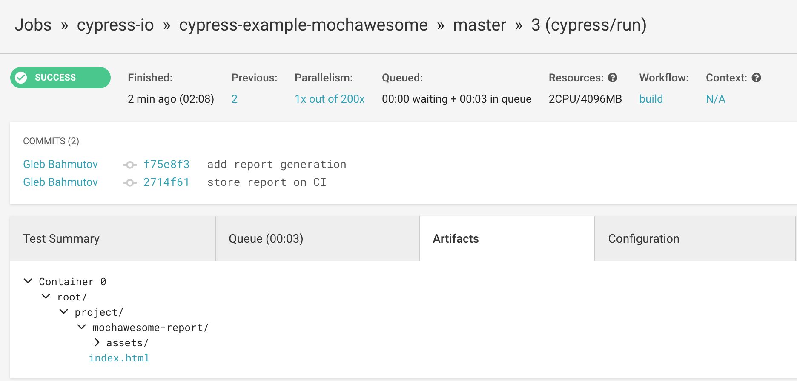
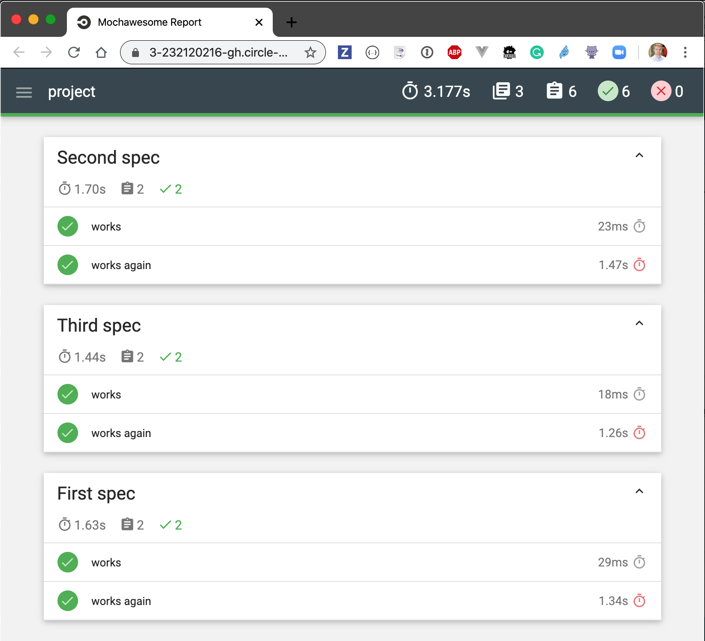
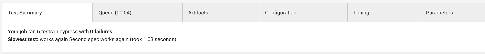
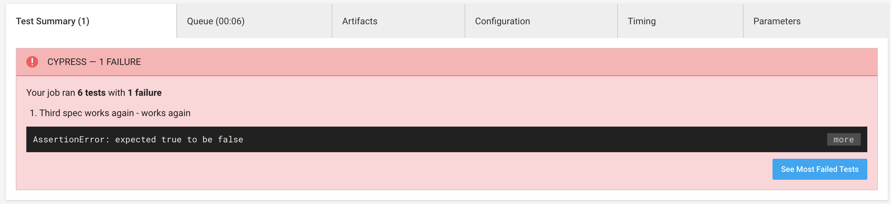
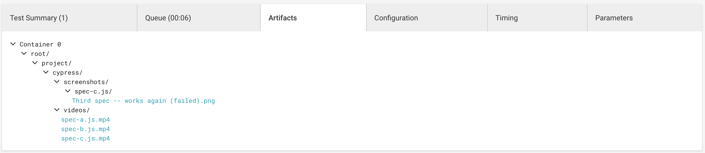

# cypress-example-reporters [![renovate-app badge][renovate-badge]][renovate-app] 
> Example showing multiple test reports merged into a single Mochawesome report

Read [Cypress Reporters Guide](https://on.cypress.io/reporters)

## CI

The tests are executed on [CircleCI](https://circleci.com/gh/cypress-io/cypress-example-reporters), see configuration file [circle.yml](circle.yml). One job generates Mochawesome report, while the second one stores JUnit test results. Both jobs store automatic screenshots and videos.

## Mochawesome

On each CI run, the generated Mochawesome report is stored as a test artifact

The report is a static site

## JUnit

JUnit test results are generated using NPM script `test:junit` and are stored on Circle.

When a test fails, the error message and stack trace is shown in the test results

Screenshots and videos stored as test artifacts can help debug the failures

[renovate-badge]: https://img.shields.io/badge/renovate-app-blue.svg
[renovate-app]: https://renovateapp.com/
